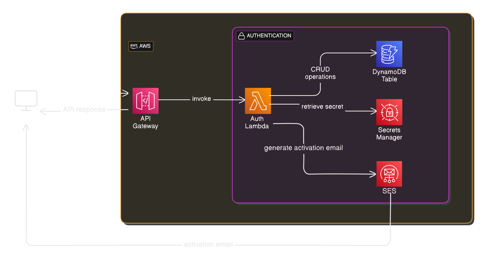

# Auth API

## Overview
Simple authentication API with user registration, activation, login, account info retrieval, password reset, and account deletion. It leverages **SAM** to define and deploy the Lambda-based microservices, DynamoDB table, and Secrets Manager resource.

## Architecture Diagram
 

## Technologies & Services
- **AWS Lambda** – Handles registration, activation, authentication, and user management logic.
- **Amazon API Gateway** – Exposes REST endpoints (`/auth/...`) to interact with the Lambda functions.
- **Amazon DynamoDB** – Stores user credentials, activation tokens, and metadata.
- **AWS Secrets Manager** – Securely stores the JWT signing secret.
- **Amazon SES** – Sends activation emails to newly registered users.
- **AWS Identity and Access Management (IAM)** – Grants essential permissions for DynamoDB, Secrets Manager, and SES.

## Implementation Details

1. **SAM Template (`template.yaml`)**  
   - Defines a `UsersTable` (DynamoDB) to store user credentials.  
   - Generates a random `JWTSecret` in Secrets Manager (the **JWT signing secret**).  
   - Deploys the `AuthFunction` (Python **AWS Lambda**) with an API Gateway interface, mapping routes for registration, activation, login, retrieval, update, or deletion of user data.  
   - Sets environment variables (`USERS_TABLE`, `JWT_SECRET_NAME`) and IAM policies for DynamoDB, Secrets Manager, and SES.  
   - Creates **API Gateway** events for each relevant endpoint (e.g., `/auth/register`, `/auth/activate`, `/auth/login`, etc.).  

2. **Lambda Function (`lambda_function.py`)**  
   - **Routing:** Uses a dictionary (`ROUTES`) keyed by `(path, method)` to dispatch to specialized handlers (e.g., `handle_register`, `handle_user`).  
   - **Error Handling & Logging:** Logs events and exceptions to CloudWatch for easier debugging.  
   - **JWT Authentication Decorator (`require_auth`):** Protects certain endpoints (e.g., fetching or deleting a user) by verifying a JWT token.  

3. **Database & Secrets**  
   - **DynamoDB**: Stores usernames, hashed passwords (with bcrypt), activation tokens, timestamps, and `is_active` status.  
   - **Secrets Manager**: Retrieves the JWT secret used to sign and verify tokens.  

4. **Email Activation Flow**  
   - A **SES** email is sent from set authorized `SENDER_EMAIL` with an activation link (`/auth/activate?token=...`) upon registration.  
   - Clicking the link validates the token and updates the `is_active` field in DynamoDB.  

## Project Structure
```
auth-api
├── template.yaml               # SAM template defining the auth-api resources
└── src
    ├── requirements.txt        # Python dependencies
    ├── lambda_function.py      # Main Lambda entry point with route dispatch
    ├── handlers.py             # Handlers for register, activate, login, user mgmt
    ├── auth_service.py         # JWT secret retrieval, token verification
    └── response_utils.py       # Utilities for success/error HTTP responses
```

## Prerequisites
- AWS SAM CLI installed
- AWS credentials configured
- A verified email address in AWS SES (in the region you're deploying to)

## Building and Deploying
### Build the application
```bash
sam build
```
### Deploy the application

 *First time deployment:*
```
sam deploy --guided
```
*Subsequent deployments:*
```
sam deploy --parameter-overrides SenderEmail=verified.email@domain.com
```

## Testign Locally
```
sam local start-api --parameter-overrides SenderEmail=verified.email@domain.com
```